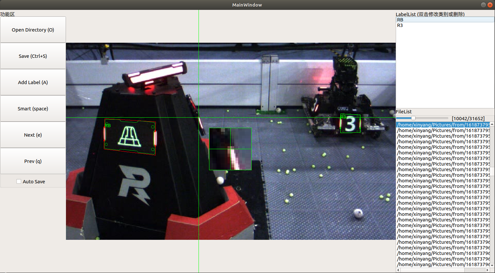

# RoboMaster智能数据集标注工具

基于[**Qt5+OpenCV(with OpenVINO)**]，用于标注RoboMaster装甲板4个顶点的位置，灯条颜色，以及贴纸类型。

## 项目介绍

基于深度学习的自瞄识别算法逐渐走进RoboMaster的赛场。相比于传统视觉识别算法，基于深度学习的算法具有更强的鲁棒性和适应性，受到了不少队伍的青睐。

然而常规深度学习的目标检测算法只能识别出目标的外接矩形，这给后续算法中的单目测距带来了困难。

本项目希望能够建立一个便利的4点数据集标注工具，可以快速而准确的完成数据集的制作。

## 主要功能亮点

* 将标准装甲板贴纸图像叠加到图片上，便于观察选取结果。
* 选点时局部放大，便于观察选点位置。
* 智能预识别，减轻人力。(需要带OpenVINO支持的OpenCV)
* 图像的缩放与拖动。(TODO)

TODO：目前智能预识别模型不正常识别基地贴纸，且大目标识别效果较差。有待进一步更新。

## 程序界面图

由于github图像缩放，可能导致看不太清楚，可以点击查看大图。



## 编译运行

支持使用cmake进行编译。

cmake编译方法:

```shell
mkdir build
cd build
cmake ..
make
```

OpenCV With OpenVINO的安装方法：[官网链接](https://software.intel.com/content/www/us/en/develop/tools/openvino-toolkit/download.html)，安装OpenVINO SDK包，其中自带OpenCV With OpenVINO。

## 使用方法

* 首先选择图片文件夹目录，程序会自动查找目录下所有图片文件。(jpg、jpeg、png)
* 点击smart自动预标注当前图片。或点击Add Label开始标注一个装甲板。
* 按照装甲板**左侧灯条上端、左侧灯条下端、右侧灯条下端、右侧灯条上端**的顺序，依次点击。
* 双击右上方的当前目标项，选择当前目标的类别。
* 根据需求，微调4个点的位置，使得叠加的标准装甲板边缘和实际图像中的装甲板边缘对齐。（标准装甲板边缘默认图像没有畸变，追求标注精度的话，需要对数据集中的图片进行去畸变）。
* 点击保存或勾选自动保存完成当前图片的标注。

## 装甲板类别命名与类别编号

| 贴纸↓颜色→ | B（蓝色） | R（红色） | N（熄灭） | P（紫色） |
| ---------- | --------- | --------- | --------- | --------- |
| G（哨兵）  | 0         | 7         | 14        | 21        |
| 1（一号）  | 1         | 8         | 15        | 22        |
| 2（二号）  | 2         | 9         | 16        | 23        |
| 3（三号）  | 3         | 10        | 17        | 24        |
| 4（四号）  | 4         | 11        | 18        | 25        |
| 5（五号）  | 5         | 12        | 19        | 26        |
| B（基地）  | 6         | 13        | 20        | 27        |

## 数据集文件格式

标定后的数据集文件和图片位于同一文件夹，将图片后缀名修改为txt即为数据集文件。

txt文件中每一行代表一个目标，如果一个文件有多行，则说明对应图片内有多个目标。

一行共计9个数字，以空格分割。从左到右依次为：
* 装甲板类别编号
* 左上角x坐标
* 左上角y坐标
* 左下角x坐标
* 左下角y坐标
* 右下角x坐标
* 右下角y坐标
* 右上角x坐标
* 右上角y坐标

---

如果觉得该项目对你有帮助请点一个Star：）
